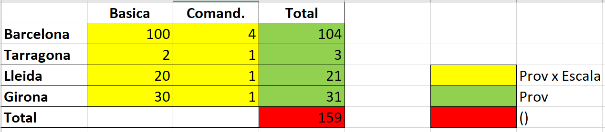
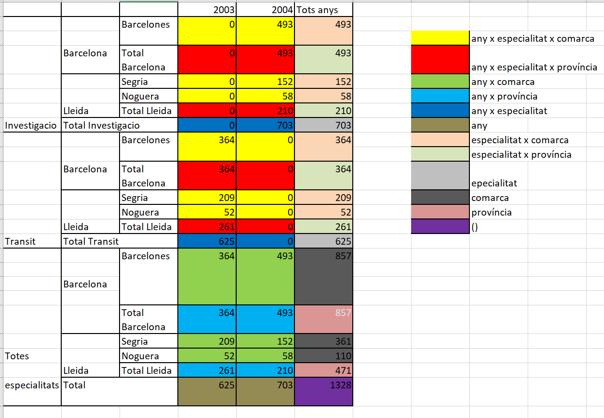

# Solucions L3-Training

## Qüestió 1

```sql
CREATE TABLE families (
    familia CHAR(20),
    reproduccio CHAR(10),
    PRIMARY KEY (familia));

CREATE TABLE peixos (
    especie CHAR(20),
    familia CHAR(20) NOT NULL,
    color CHAR(10) NOT NULL,
    raresa INTEGER,
    PRIMARY KEY (especie),
    UNIQUE (familia, color),
    FOREIGN KEY (familia) REFERENCES families(familia));
```

## Qüestió 2

```sql
create table pais
(paisAg char(1) PRIMARY KEY,
pib char(1));

CREATE TABLE agencies
(ag char(1) PRIMARY KEY,
paisAg char(1),
FOREIGN KEY (paisAg) REFERENCES pais);

create table deute
(paisD char(1),
paisAc char(1),
deute char(1),
PRIMARY KEY (paisD,paisAc));

create table r
(ag char(1),
paisD char(1),
paisAc char(1),
PRIMARY KEY(ag,paisD,paisAc),
FOREIGN KEY (ag) REFERENCES agencies,
FOREIGN KEY (paisD,paisAc) REFERENCES deute);
```

## Qüestió 3

```sql
CREATE TABLE objects (
id_object NUMBER PRIMARY KEY,
descr_object VARCHAR2(100));

CREATE TABLE peers (
peer_id NUMBER PRIMARY KEY,
peer_url VARCHAR(50) UNIQUE NOT NULL);

CREATE TABLE files (
file_id NUMBER PRIMARY KEY,
file_size NUMBER,
file_extension VARCHAR2(3),
id_object NUMBER REFERENCES objects(id_object));

CREATE TABLE shares (
peer_id NUMBER REFERENCES peers(peer_id),
file_id NUMBER REFERENCES files(file_id),
PRIMARY KEY(peer_id, file_id));
```

## Qüestió 4

```sql
CREATE VIEW nomVista AS
SELECT r.escala, p.provincia, SUM(d.mossos) AS aggr
FROM destinacio d, data t, poblacio p, rang r
WHERE d.poblacioId=p.nom AND d.dataId=t.id AND r.nom=d.rangId
  AND t.anyo='2009' AND p.provincia IN ('Barcelona','Tarragona','Lleida','Girona') AND r.escala IN ('Basica','Comand.') AND d.especialitatID='Antidisturbi'
GROUP BY ROLLUP(p.provincia, r.escala);
```



## Qüestió 5

```sql
CREATE VIEW nomVista AS
SELECT p.comarca, p.provincia, d.especialitatId, t.anyo, SUM(d.mossos) AS aggr
FROM destinacio d, data t, poblacio p
WHERE d.poblacioId=p.nom AND d.dataId=t.id
  AND t.anyo IN ('2003', '2004') AND p.comarca IN ('Barcelones','Segria', 'Noguera') AND d.especialitatID IN ('Transit', 'Investigacio')
GROUP BY CUBE(t.anyo, d.especialitatId), ROLLUP(p.provincia, p.comarca);
```




