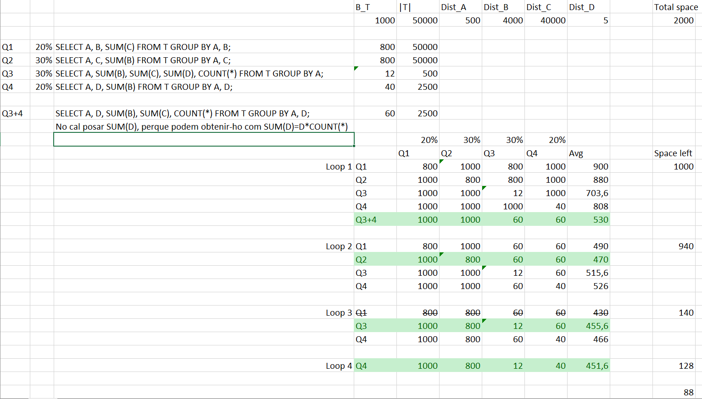

# Solucions L4-Training Materialized views

## Qüestió 1

```sql
CREATE MATERIALIZED VIEW V5
BUILD IMMEDIATE
REFRESH COMPLETE ON DEMAND
ENABLE QUERY REWRITE
AS (SELECT cand,pobl, MAX(val)
      FROM CentMilResp
      GROUP BY cand, pobl);

CREATE MATERIALIZED VIEW V1
BUILD IMMEDIATE
REFRESH COMPLETE ON DEMAND
ENABLE QUERY REWRITE
AS (SELECT cand, MAX(val)
       FROM CentMilResp
       GROUP BY cand);
```


## Qüestió 2

```sql
CREATE MATERIALIZED VIEW V1
BUILD IMMEDIATE
REFRESH COMPLETE ON DEMAND
ENABLE QUERY REWRITE
AS (SELECT cand,edat, AVG(val),MAX(val),COUNT(*)
      FROM CentMilResp
      GROUP BY cand, edat);
```


## Qüestió 3

```sql
CREATE MATERIALIZED VIEW V2
BUILD IMMEDIATE
REFRESH COMPLETE ON DEMAND
ENABLE QUERY REWRITE
AS (SELECT A,C, SUM(B)
      FROM T
      GROUP BY A,C);

CREATE MATERIALIZED VIEW V3
BUILD IMMEDIATE
REFRESH COMPLETE ON DEMAND
ENABLE QUERY REWRITE
AS (SELECT A,SUM(B), SUM(C),SUM(D),COUNT(*)
      FROM T
      GROUP BY A);

CREATE MATERIALIZED VIEW V4
BUILD IMMEDIATE
REFRESH COMPLETE ON DEMAND
ENABLE QUERY REWRITE
AS (SELECT A,D, SUM(B)
      FROM T
      GROUP BY A,D);
```


