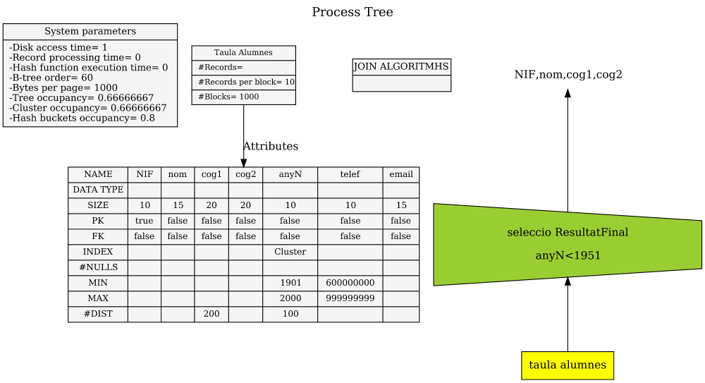
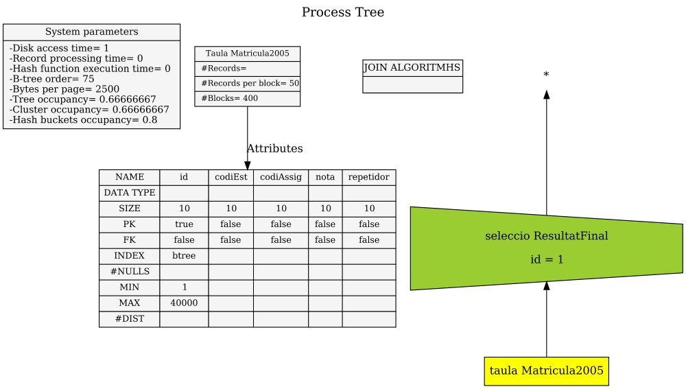
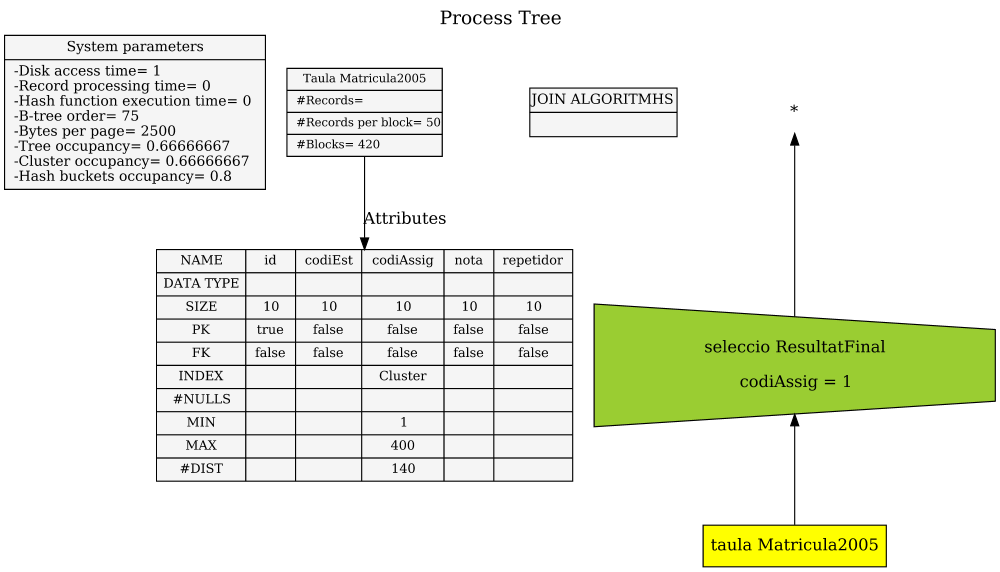
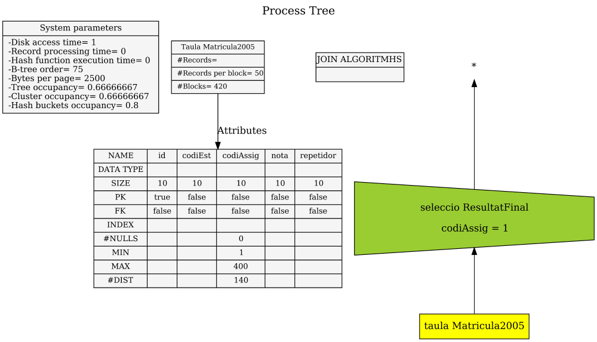
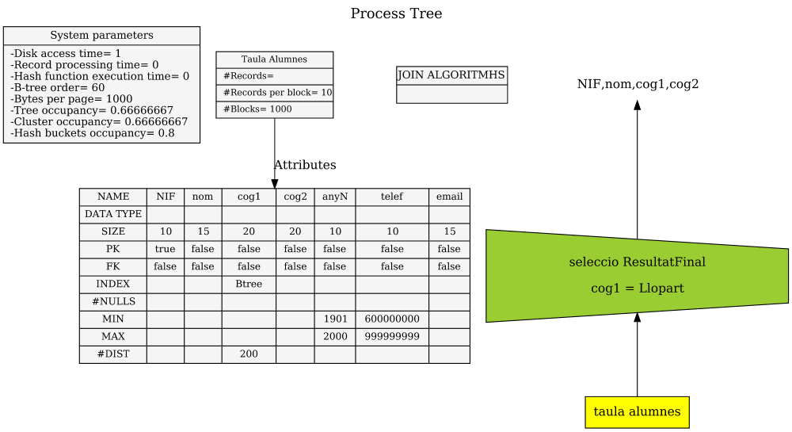
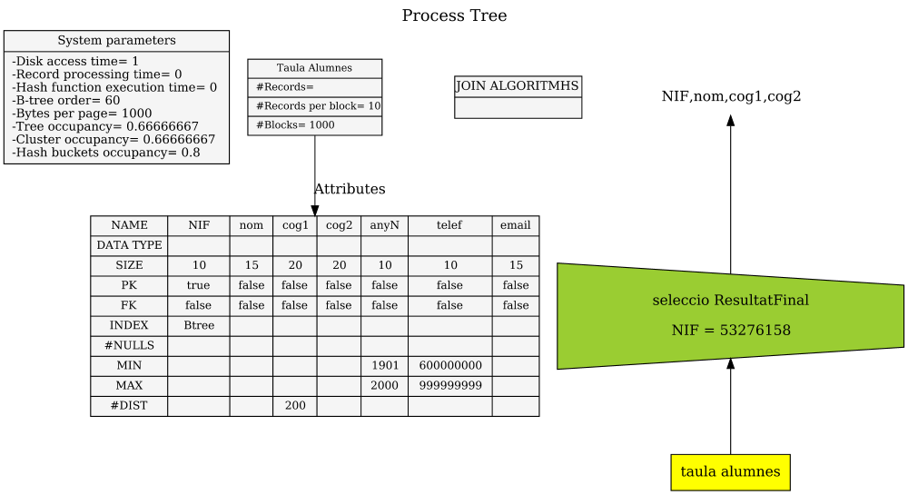
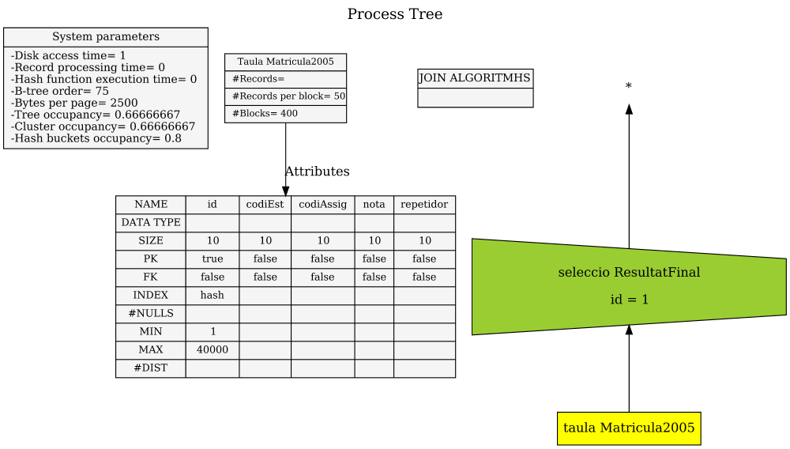
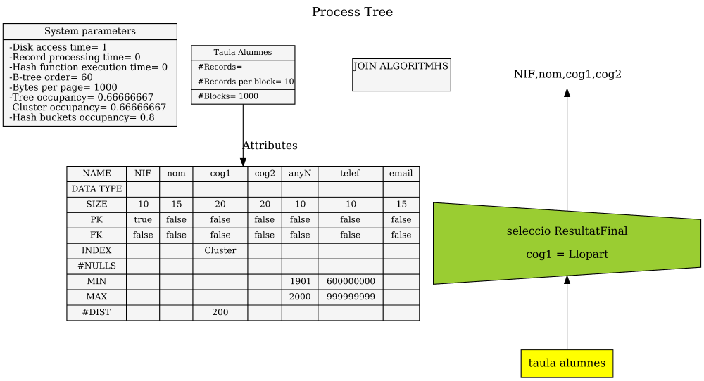
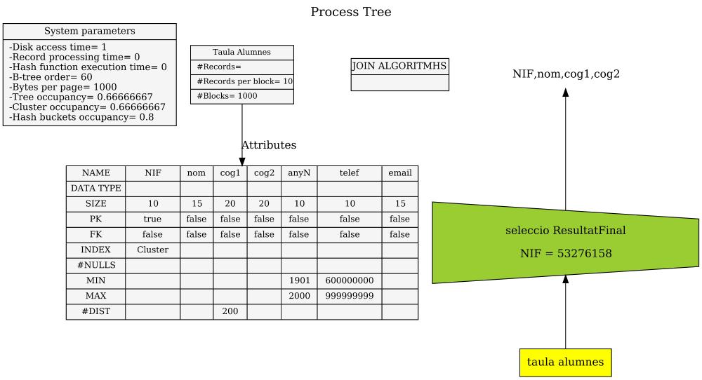
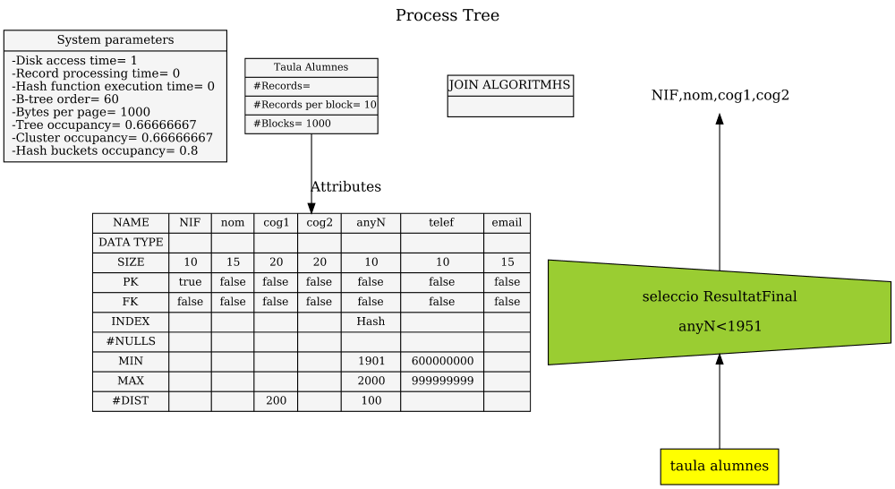

# Solucions L5-Training Extra Selection Costs

## Ex 01 (AT-214)

* **Possibilitats:** B+ o SCAN
* **B+ per trobar més d'una fila**
    * files = 1000 blocs \* 10 files/bloc = 10000 files
    * h + (|O|-1)/u + |O| (segons formula a les transparències del curs)
    * u = 2\*d\*%load = 2\*60\*0,6666667 = 80
    * h = $\lceil \log_{80} (10000) \rceil - 1 = \lceil 2.49 \rceil - 1 = 3 - 1 = 2$
    * |O| = número de files resultants = 50 valors \* 100 files/valor (#NDIST) = 5000 files
    * cost = 2 + (5000-1)/80 + 5000 = 2 + 62.4875 + 5000 = 5064,4875
    * cost = 5064,50
* **Scan per més d'una fila**
    * B (segons formula a les transparències del curs)
    * cost = 1000
* **Solució** cost = 1000

## Ex 02 (AT-218)

* **Possibilitats:** cluster o SCAN
* **Cluster per trobar més d'una fila**
    * files = 1000 blocs \* 10 files/bloc = 10000 files
    * h + 1 + 1,5\*(\|O|-1)/R (segons formula a les transparències del curs)
    * u = 2\*d\*%load = 2\*60\*0,6666667 = 80
    * h = $\lceil \log_{80} (10000) \rceil - 1 = \lceil 2.49 \rceil - 1 = 3 - 1 = 2$
    * |O| = número de files resultants = 50 valors \* 100 files/valor (#NDIST) = 5000 files
    * R = 10 files per bloc
    * cost = 2 + 1 + 1,5\*(5000-1)/10 = 3 + 1,5\*4999/10 = 3 + 749,85 = 752,85
    * cost = 752,85
* **Scan per més d'una fila**
    * B (segons formula a les transparències del curs)
    * cost = 1000
* **Solució** cost = 752,85

## Ex 03 (AT-198)

* **Possibilitats:** Hash o SCAN
* **Hash per trobar més d'una fila amb un únic valor**
    * files a la taula = 420 blocs \* 50 files/bloc = 21000 files
    * v = 1 (es busca files que tenen un únic valor)
    * 1 + k (segons formula a les transparències del curs)
    * #DIST = 200 valors diferents del codiAssig
    * k = 21000 files / 200 valors = 105 files per cada valor
    * cost = 1 + 105 = 106
* **Scan per més d'una fila**
    * B (segons formula a les transparències del curs)
    * cost = 420
* **Solució** cost = 106

## Ex 04 (AT-192)

* **Possibilitats:** B+ o SCAN
* **B+ per trobar una única fila**
    * files = 400 blocs \* 50 files/bloc = 20000 files
    * h + 1 (segons formula a les transparències del curs)
    * u = 2\*d\*%load = 2\*75\*0,6666667 = 100
    * h = $\lceil \log_{100} (20000) \rceil - 1 = \lceil 2.30 \rceil - 1 = 3 - 1 = 2$
    * cost = 2 + 1 = 3
* **Scan per trobar una única fila**
    * 0,5\*B (segons formula a les transparències del curs)
    * cost = 0,5\*400 = 200
* **Solució** cost = 3

## Ex 05 (AT-197)

* **Possibilitats:** cluster o SCAN
* **Cluster per trobar més d'una fila**
    * files = 420 blocs \* 50 files/bloc = 21000 files
    * h + 1 + 1,5\*(\|O|-1)/R (segons formula a les transparències del curs)
    * u = 2\*d\*%load = 2\*75\*0,6666667 = 100
    * h = $\lceil \log_{100} (21000) \rceil - 1 = \lceil 2.32 \rceil - 1 = 3 - 1 = 2$
    * |O| = número de files resultants = 21000 files / 140 valors diferents = 150 files que tenen un valor
    * R = 50 files per bloc
    * cost = 2 + 1 + 1,5\*(150-1)/50 = 3 + 1,5\*149/50 = 3 + 4,47 = 7,47
    * cost = 7,47
* **Scan per més d'una fila**
    * B (segons formula a les transparències del curs)
    * cost = 420
* **Solució** cost = 7,47

## Ex 06 (AT-195)

* **Possibilitats:** SCAN (No hi ha cap estructura d'accés)
* **Scan per trobar més d'una fila**
    * B (segons formula a les transparències del curs)
    * B = 420
* **Solució** cost = 420

## Ex 07 (AT-194)

* **Possibilitats:** cluster o SCAN
* **Cluster per trobar una única fila**
    * files = 400 blocs \* 50 files per bloc = 20000 files
    * h + 1 (segons formula a les transparències del curs)
    * u = 2\*d\*%load = 2\*75\*0,6666667 = 100
    * h = $\lceil \log_{100} (20000) \rceil - 1 = \lceil 2.30 \rceil - 1 = 3 - 1 = 2$
    * cost = 2 + 1 = 3
* **Scan per trobar una única fila**
    * 0,5\*B (segons formula a les transparències del curs)
    * cost = 0,5\*400 = 200
* **Solució** cost = 3

## Ex 08 (AT-215)

* **Possibilitats:** B+ o SCAN
* **B+ per trobar més d'una fila**
    * files = 1000 blocs \* 10 files/bloc = 10000 files
    * h + (|O|-1)/u + |O| (segons formula a les transparències del curs)
    * u = 2\*d\*%load = 2\*60\*0,6666667 = 80
    * h = $\lceil \log_{80} (10000) \rceil - 1 = \lceil 2.49 \rceil - 1 = 3 - 1 = 2$
    * |O| = número de files resultants = 10000 files / 200 cognoms = 50 files per cognom
    * cost = 2 + (50-1)/80 + 50 = 2 + 49/80 + 50 = 2 + 0.6125 + 50 = 52.6125
    * cost = 52,61
* **Scan per més d'una fila**
    * B (segons formula a les transparències del curs)
    * cost = 1000
* **Solució** cost = 52,74

## Ex 09 (AT-216)

* **Possibilitats:** B+ o SCAN
* **B+ per trobar una única fila**
    * files = 1000 blocs \* 10 files/bloc = 10000 files
    * h + 1 (segons formula a les transparències del curs)
    * u = 2\*d\*%load = 2\*60\*0,6666667 = 80
    * h = $\lceil \log_{80} (10000) \rceil - 1 = \lceil 2.49 \rceil - 1 = 3 - 1 = 2$
    * cost = 2 + 1 = 3
* **Scan per trobar una única fila**
    * 0,5\*B (segons formula a les transparències del curs)
    * cost = 0,5\*1000 = 500
* **Solució** cost = 3

## Ex 10 (AT-217)

* **Possibilitats:** B+ o SCAN
* **B+ per trobar més d'una fila**
    * files = 1000 blocs \* 10 files/bloc = 10000 files
    * h + (|O|-1)/u + |O| (segons formula a les transparències del curs)
    * u = 2\*d\*%load = 2\*60\*0,6666667 = 80
    * h = $\lceil \log_{80} (10000) \rceil - 1 = \lceil 2.49 \rceil - 1 = 3 - 1 = 2$
    * |O| = número de files resultants = Es busca els telèfons en 1/4 part de les files = 1/4 \* 10000 files = 2500 telèfons (10000 files / 10000 telèfons diferents) = 1 fila per telèfon.
    * cost = 2 + (2500-1)/80 + 2500 = 2 + 2499/80 + 2500 = 2 + 31.2375 + 2500 = 2533.2375
    * cost = 2531,23
* **Scan per més d'una fila**
    * B (segons formula a les transparències del curs)
    * cost = 1000
* **Solució** cost = 1000

## Ex 11 (AT-193)

* **Possibilitats:** Hash o SCAN
* **Hash per trobar una única fila**
    * cost = 2 (segons formula a les transparències del curs)
    * cost = 2
* **Scan per trobar una única fila**
    * 0,5\*B (segons formula a les transparències del curs)
    * cost = 0,5\*400 = 200
* **Solució** cost = 2

## Ex 12 (AT-219)

* **Possibilitats:** cluster o SCAN
* **Cluster per trobar més d'una fila**
    * files = 1000 blocs \* 10 files/bloc = 10000 files
    * h + 1 + 1,5\*(\|O|-1)/R (segons formula a les transparències del curs)
    * u = 2\*d\*%load = 2\*60\*0,6666667 = 80
    * h = $\lceil \log_{80} (10000) \rceil - 1 = \lceil 2.49 \rceil - 1 = 3 - 1 = 2$
    * |O| = número de files resultants = 10000 files / 200 valors diferents (#NDIST) = 50 files
    * R = 10 files per bloc
    * cost = 2 + 1 + 1,5\*(50-1)/10 = 3 + 1,5\*49/10 = 3 + 7.35 = 10.35
    * cost = 10,35
* **Scan per més d'una fila**
    * 1.5\*B (segons formula a les transparències del curs)
    * cost = 1.5\*1000 = 1500
* **Solució** cost = 10,35

## Ex 13 (AT-220)

* **Possibilitats:** cluster o SCAN
* **Cluster per trobar només una fila**
    * files = 1000 blocs \* 10 files/bloc = 10000 files
    * h + 1 (segons formula a les transparències del curs)
    * u = 2\*d\*%load = 2\*60\*0,6666667 = 80
    * h = $\lceil \log_{80} (10000) \rceil - 1 = \lceil 2.49 \rceil - 1 = 3 - 1 = 2$
    * cost = 2 + 1 = 3
* **Scan per només una fila**
    * 0,5\*B (segons formula a les transparències del curs)
    * cost = 0,5\*1000 = 500
* **Solució** cost = 3

## Ex 14 (AT-222)

* **Possibilitats:** Hash o SCAN
* **Hash per trobar més d'una fila amb un únic valor**
    * No es pot aplicar en casos de buscar atr > v
* **Scan per més d'una fila**
    * B (segons formula a les transparències del curs)
    * cost = 1000
* **Solució** cost = 1000