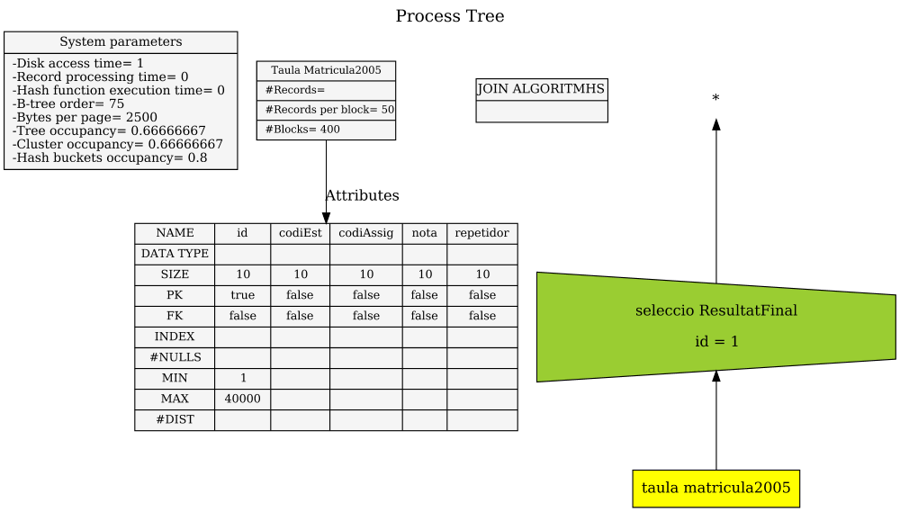
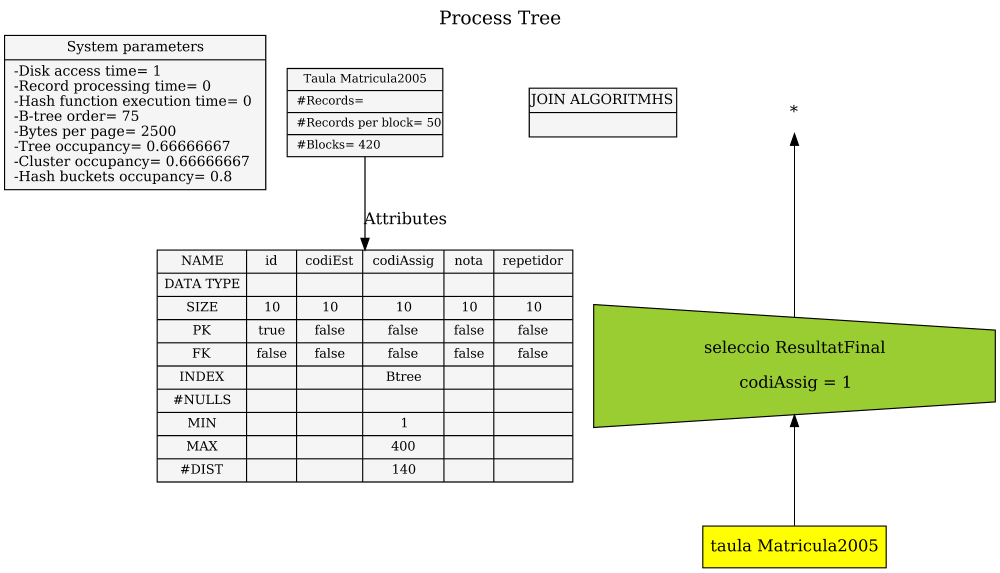
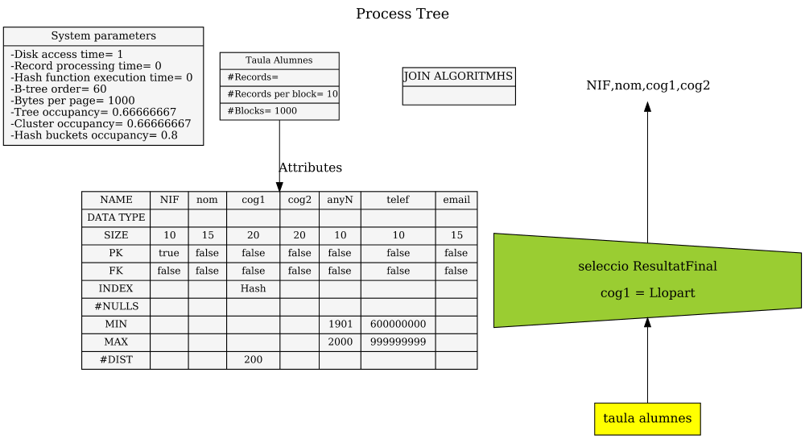
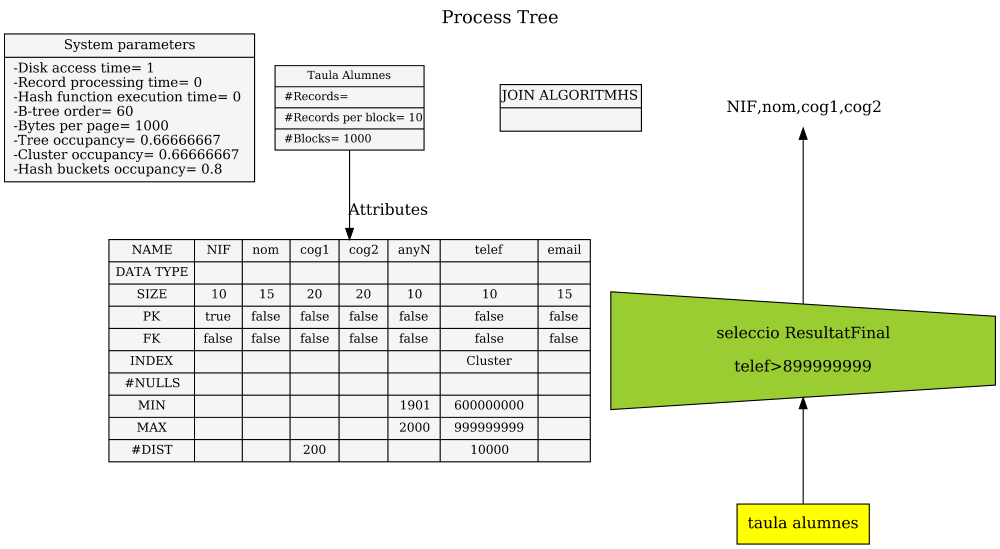
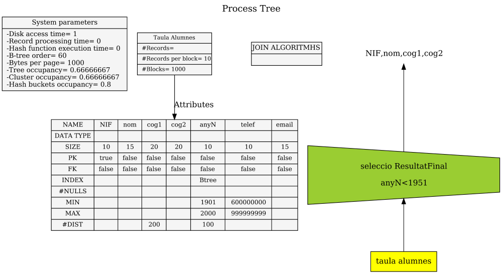

## Solucions justificades del training 5

## Ex 01 (AT-191)

* **Possibilitats:** Només **SCAN** (No hi ha cap índex)
* **Scan per trobar una única fila** (Id té valor únic a la taula)
    * 0,5\*B (segons formula a les transparències del curs)
    * cost = 0,5\*400 = 200
* **Solució** cost = 200

## Ex 02 (AT-196)

* **Possibilitats:** **B+** o SCAN
* **B+ per trobar més d'una fila**
    * files = 420 blocs\*50 files/bloc = 21000 files
    * h + (|O|-1)/u + |O| (segons formula a les transparències del curs)
    * u = 2\*d\*%load = 2\*75\*0,6666667 = 100
    * h = $\lceil \log_{100} (21000) \rceil - 1 = \lceil 2.32 \rceil - 1 = 3 - 1 = 2$
    * |O| = número de files resultants = 21000 files / 140 files/valor (#NDIST) = 150 files
    * |O| = v * k = 1 * 150 = 150
    * cost = 2 + (150-1)/100 + 150 = 153,49
* **Scan per més d'una fila**
    * B (segons formula a les transparències del curs)
    * cost = 420
* **Solució** cost = 153,49

> **v**: Número de valors diferents de la cerca. En aquest cas, només tenim "codiAssig=1" per la qual cosa, nomes tenim **1** valor a la cerca.

> **k**: Número de **repeticions** de tots els valors en la cerca. 
> * Tenim **140** valor diferents de l'atribut **codiAssig** (a la taula).
> * Tenim **21.000** files, per la qual cosa, cada atribut de **codiAssig** es **repetira** de mitja **k** = |T|/140 = 21.000/140 = **150**.  

## Ex 03 (AT-223)

* **Possibilitats:** **Hash** o SCAN
* **Hash per trobar més d'una fila amb un únic valor**
    * files = 1000 blocs \* 10 files/bloc = 10000 files
    * v=1
    * 1 + k (segons formula a les transparències del curs)
    * #DIST = 200 valors diferents del codiAssig
    * k = 10000 files / 200 valors = 50 files per cada valor
    * cost = 1 + 50 = 51
* **Scan per més d'una fila**
    * B (segons formula a les transparències del curs)
    * cost = 1000
* **Solució** cost = 51

## Ex 04 (AT-221)

* **Possibilitats:** **cluster** o SCAN
* **Cluster per trobar més d'una fila**
    * files = 1000 blocs \* 10 files/bloc = 10000 files
    * h + 1 + 1,5\*(|O|-1)/R (segons formula a les transparències del curs)
    * u = 2\*d\*%load = 2\*60\*0,6666667 = 80
    * h = $\lceil \log_{80} (10000) \rceil - 1 = \lceil 2.49 \rceil - 1 = 3 - 1 = 2$
    * |O| = número de files resultants = Es busca els telèfons en 1/4 part de les files = 1/4 \* 10000 files = 2500 telèfons (10000 files / 10000 telèfons diferents) = 1 fila per telèfon
    * R = 10 files per bloc
    * cost = 2 + 1 + 1,5\*(2500-1)/10 = 3 + 1,5\*2499/10 = 3 + 374,85 = 377,85
* **Scan per més d'una fila**
    * B (segons formula a les transparències del curs)
    * cost = 1000
* **Solució** cost = 377,85

## Ex 05 (AT-214)

* **Possibilitats:** B+ o Scan
* **SF\~=50% => |O| = 10000**
* **Cost B+: h + (|O|-1)/u + |O| > 10000 ---> Millor scan**
* **Solució:**
    * cost=1000