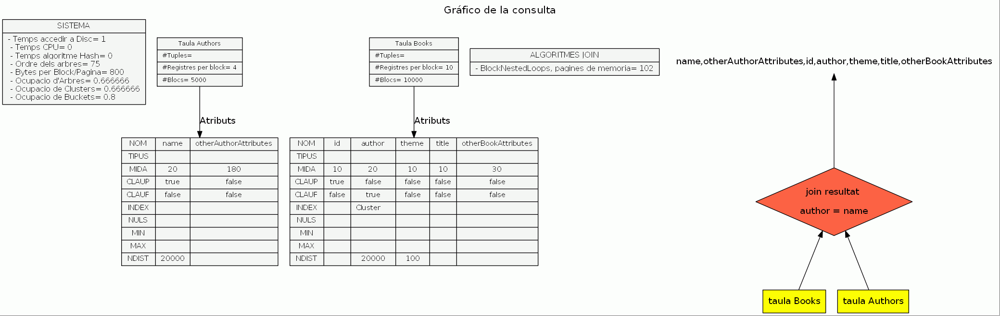
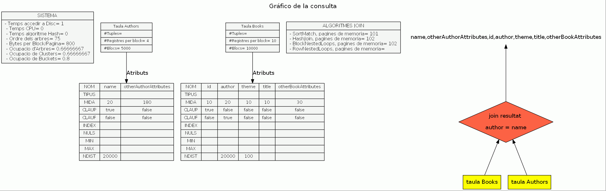
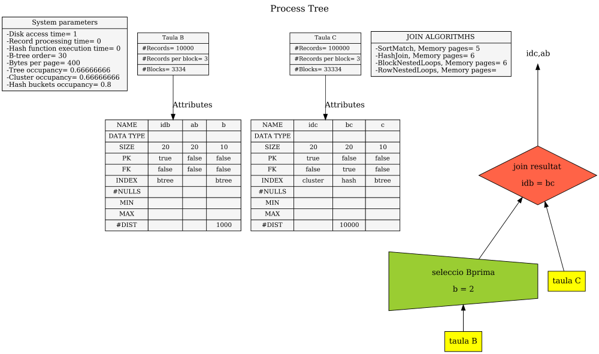
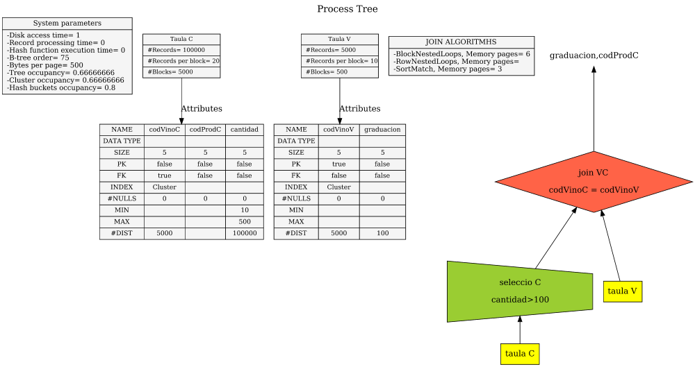

# Solucions L6-Training Join Costs

## Ex 01 (AT-204)

### Cardinalitat del join  
- **#files authors** = 5000 blocs × 4 files per bloc = **20000 files**  
- **#files books** = 10000 blocs × 10 files per bloc = **100000 files**  
- Join per la FK (FK sense valors nuls)  
- FS = 1 / |authors| = 1 / 20000  
- Fórmula de cardinalitat:  
  \|authors\| × \|books\| × (1 / \|authors\|)  
- **Cardinalitat** = 100000 × 20000 × (1 / 20000) = **100000**

### Cost (Block Nested Loops, Memory pages = 102)
- Fórmula cost = #Blocs authors + #Blocs books × ⌈#Blocs authors / pàgines de memòria⌉  
- Books té una estructura índex *Cluster*  
  → En realitat, la taula Books ocupa:  
  10000 blocs / 0.666666 ≈ **15001 blocs** (tenint en compte el *Cluster occupancy* donat a l’enunciat)
- **Cost** = 5000 + 15001 × ⌈5000 / 100⌉ = **755050**

### Solució:
- **Cardinalitat** = 100000  
- **Cost** = 755050

## Ex 02 (AT-200)

### Cardinalitat del join  
- **#files authors** = 5000 blocs × 4 files per bloc = **20000 files**  
- **#files books** = 10000 blocs × 10 files per bloc = **100000 files**  
- Join per la FK (FK sense valors nuls)  
- FS = 1 / |authors| = 1 / 20000  
- Fórmula de cardinalitat:  
  \|authors\| × \|books\| × (1 / \|authors\|)  
- **Cardinalitat** = 100000 × 20000 × (1 / 20000) = **100000**

### Cost (Row Nested Loops)  
- **Descartat**, perquè no hi ha índex per l’atribut pel qual es fa el join.

### Cost (Hash Join, Memory pages = 102)  
- Fórmula:  
  2 × Blocs authors + 2 × Blocs books + Blocs authors + Blocs books  
- **Cost** = 2×5000 + 2×10000 + 5000 + 10000 = **45000**

### Cost (Block Nested Loops, Memory pages = 102)  
- Fórmula:  
  Blocs authors + Blocs books × ⌈Blocs authors / pàgines de memòria⌉  
- **Cost** = 5000 + 10000 × ⌈5000 / 100⌉ = **505000**

### Cost (Sort-Merge Join, Memory pages = 101)  
- És necessari fer *sort* de les files de les dues taules, i després fer el *merge*.  
- Fórmula:  
  2 × Blocs authors × ⌈log₁₀₁ (Blocs authors)⌉ +  
  2 × Blocs books × ⌈log₁₀₁ (Blocs books)⌉ +  
  Blocs authors + Blocs books  
- **Cost** = 2×5000×2 + 2×10000×2 + 5000 + 10000 = **75000**

### Solució (mètode òptim: Hash Join)  
- **Cardinalitat** = 100000  
- **Cost** = 45000

## Ex 03 (AT-201)

### Cardinalitat  
- **#files B** = 10.000  
- **#files C** = 100.000  
- **Cardinalitat de la selecció B'** = B (on b = 2)  
- SF = 1 / ndist(b) = 1 / 1000  
- Resultat = #files de B × SF = 10.000 × (1 / 1000) = **10 files**

#### Cardinalitat del join (FK de C cap a B)  
- SF = 1 / #files de B  
- Resultat = #files de B' × #files de C × SF =  
  10 × 100.000 × (1 / 10.000) = **100**

---

### Cost de la selecció  
*Atribut `b` té un índex B+, es busquen 10 files entre 10.000*

- Fórmula:  
  **cost** = h + (|O| - 1) / u + |O|  
- u = 2 × d × oc = 2 × 30 × 0,666666 = **39,99**  
- h = ⌈log₃₉.₉₉ (10.000)⌉ - 1 = **2**  
- |O| = 10  ( número de files on b=2)
- **Cost selecció** = 2 + (10 - 1) / 39,99 + 10 ≈ **12,22**

---

### Cost del join (Row Nested Loop)  
- Fórmula:  
  **cost** = Blocs B' + #files B' × (1 + k), accés a C per índex Hash 
- #files B' = 10  
- Blocs B' = 1 (perquè:  
  - Cada fila = 40 bytes (es projecten 2 atributs de 20 bytes cadascun)  
  - Blocs = 400 bytes → hi caben 10 files  
  - 10 files ⇒ 1 bloc per les 10 files que surten de la selecció)  
- k = nombre mitjà de vegades que apareix un valor de B'.idb a C.bc  
  - Com `bc` no té valors nuls:  
    100.000 files / 10.000 valors únics ⇒ **k = 10**  
- **Cost join** = 1 + 10 × (1 + 10) = **111**

---

### Altres estratègies de join  
- **Sort-Merge Join** → **Descartat**, només per fer el merge ja costa Blocs B' + Blocs C  
- **Hash Join** → **Descartat**, també costa com a mínim Blocs B' + Blocs C  
- **Block Nested Loop** → **Descartat**, amb índex és millor usar Row Nested Loop

---

### Solució  
- **Cardinalitat** = 100  
- **Cost total** = cost selecció + cost join = **12,22 + 111 = 123,22**

## Ex 04 (AT-210)

### Cardinalitat

- **#files C** = 100.000  
- **#files V** = 5.000  

#### Selecció a C: (cantidad > 100)  
- SF = (max - c) / (max - min) = (500 - 100) / (500 - 10) = **0,8163265**  
- Resultat = 100.000 × 0,8163265 = **81.633 files**

#### Join (FK de C → V per l'atribut de join)  
- SF = 1 / #files V  
- Resultat = 81.633 × 5.000 × (1 / 5.000) = **81.633 files**  
- **Cardinalitat final** = 81.633 files

---

### Cost de la selecció

- No hi ha estructura d'accés ⇒ **cal fer un SCAN**  
- Taula C té índex cluster ⇒ hi ha espai lliure als blocs  
- Taula C ocupa 5.000 blocs / 0,666666 = **7.501 blocs** (tenint en compte el *cluster occupancy*)  
- **Cost selecció** = **7.501 blocs**

---

### Cost del join: Sort Match (Memory pages = 3)

Condicions favorables:  
- Taula V ordenada per `codiVinoV` (índex cluster)  
- Taula C ordenada per `codiVinoC` (índex cluster)  
- C' també està ordenada perquè s’ha obtingut mitjançant un SCAN de C    

Com que la join és pels atributs en què estan ordenades V i C' per aplicar aquest algorisme no cal tenir els costos de sort de les dues taules, només cal el cost de merge:

- El #Blocs reals de V s'ha de calcular tenint en compte que té un índex cluster. #Blocs reals de V = #Blocs V / cluster occupancy: 

- **#Blocs V** = 500 / 0,66666666 = **751 blocs**  

- El #Blocs C' s'ha de calcular tenint en compte els bytes per bloc de l'espai intermedi on es guarden dades (Bytes per page = 500) i quan ocupen les files de C'  (els atributs de C' són codiVinoC i codiProdC, la informació de control ocupa 0, total 10 bytes)

- **#Blocs C'**:  
  - Atributs de C': `codiVinoC`, `codiProdC`  
  - Mida fila = 10 bytes  
  - Blocs de 500 bytes ⇒ 500 / 10 = **50 files/bloc**  
  - 81.633 / 50 = **1.633 blocs**

- **Cost join (Sort Match)** = 1.633 + 751 = **2.384 blocs**

---

### Altres estratègies de join

#### Block Nested Loops (Memory pages = 6)

- Fórmula:  
  **cost** = #Blocs V + #Blocs C' × ⌈#Blocs V / pàgines de memòria⌉  
- Ja es veu que el cost serà superior al del **Sort Match**

#### Row Nested Loops

- Només V té índex  
- C tenia índex, però **C' no en té**  
- Loop exterior ha de ser C'  
- Fórmula:  
  **cost** = #Blocs C' + #files C' × (hv + 1 + 1,5 × (k - 1) / Rv)  
- També es dedueix que el cost serà superior al del Sort Match

---

### Solució  
- **Cardinalitat** = 81.633  
- **Cost total** = cost selecció + cost join (Sort Match) = 7.501 + 2.384 = **9.885**

